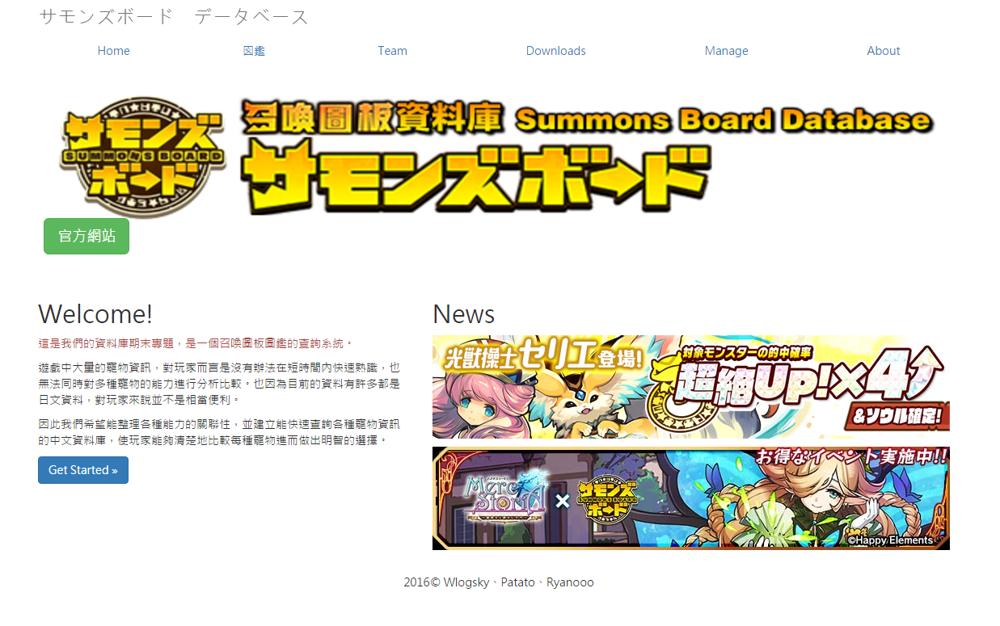

# SummonsBoard (サモンズボード)

#關於遊戲

召喚圖板（ サモンズボード ）是日本 Gungho 線上娛樂開發的智慧型手機遊戲，其戰鬥方式是這款遊戲最大的亮點，使用戰棋規則來作戰，玩家需要在 4X4 的棋盤中動腦思考在限定條件下如何破敵致勝，這是與其他遊戲不同的地方，在戰鬥中，玩家最多可以使用 4 隻怪。
                
而戰鬥是採用回合制，一開始會是我方回合，隊伍中你只能選擇一隻怪物來移動，移動完以後就會換成敵方的回合，因此玩家必須謹慎思考要移動哪隻怪物才能獲得最大攻擊效益。而在一些關卡中甚至會出現嚴苛的限制條件，增加關卡的難度，例如遊戲的回合限制、地圖障礙或是寵物類型限制。另外遊戲中的寵物都有其獨特性，因此玩家對於遊戲中的寵物養成、寵物特性等，必須非常了解才能在攻略關卡時無往不利，旗開得勝。

#關於系統

此系統可用ID搜尋寵物，並能顯示基本的寵物資訊。管理者可以依據官方最新資訊新增、刪除或修改此系統上的寵物資訊。
首頁會顯示出目前官方資訊供玩家查閱。除此之外為了方便玩家能依據關卡需要搜尋寵物，Team分頁的功能提供玩家能依據特定的條件選出適合的寵物。

このページで使うデータベースはGoogleのFireBaseです、使う人はSQLをインストールする必要がありません。

##作者 :
Wlogsky ss840429@gmail.com 

